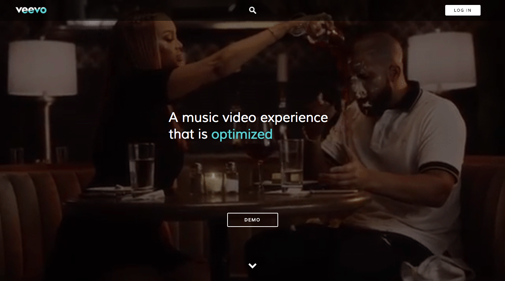

# Veevo

[Live](https://veevo.online/)

Veevo is a full-stack web application inspired by Vevo, an online music video playing application. It utilizes Ruby on Rails on the backend, a PostgreSQL database, and React.js with a Redux architectural framework on the frontend.

## Features & Implementation

### Music Video playing

Users can stream video content while navigating around the player webpage's tabs and adding music videos to playlists. This is due front-end architecture; it is a single-page web app that dynamically renders React components.

The video show page has three tabs underneath the player depending on whether a video or playlist is being played. "Related Videos", "Up Next", and "New Videos" carousels show links to other videos.

#### Music Video View Counts

On the music player page, users can also see the current music video's view counts. These numbers change with every render of the page.

### Playlist creating, editing, and deleting

Users can organize tracks into playlists. Playlists are stored in a playlist table that tracks a playlist's `id`, `title`, `description`, and `playlist_image_url`. Playlists are associated with music videos via a PlaylistMusicVideos join table that tracks a `playlist_id` and a `mv_id`. The join table is indexed on `playlist_id` for quick fetching all of the music videos in a playlist.

#### Playlist player

Playlists also have player pages with tabs that list details, other music videos on the playlist, and music video details. From the playlist player, users can edit the playlist's `title`, `description`, and `playlist_image_url`

### User Page

User's have user pages that list their `username`, `description`, `user_image_url`, and created playlists. On the user profile page, user's may edit their details, browse their own playlists, or create a new playlist.

### Search

User's can search for music videos. Search API calls are made dynamically each user's keystroke in the search query. The API finds and returns music videos with `titles` or `artists` that match the user's search query.

### User Experience

Veevo's smooth, desktop app-like interface was created with user experience in and functionality in mind. This was largely accomplished via the React/Redux architectural pattern, which rendered expensive full page refreshes unnecessary.

To make navigating around the website more responsive, some data - such as music video and user's playlist's information - is pre-fetched and loaded into the application's state. This makes many further AJAX requests unnecessary as users navigate and browse through the app.
